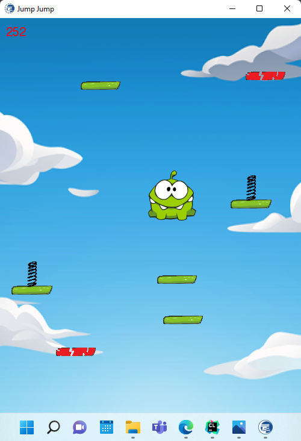

# BTL-Game-Jumping

**Sử dụng**
-
1. IDE Clion
2. Mingw-w64
3. Ngôn ngữ C++
4. Đồ họa SFML 2.5.1

**Hướng dẫn cài đặt**
-
1. Cài đặt môi trường code C++ và đồ họa SFML
2. Vào link github tải project dạng ZIP về máy và giải nén 
   [link github] https://github.com/21020718/Project-Jumping.git
3. Vào __Project-Jumping\include\CONST.h__ đổi các biến lưu đường dẫn theo đường dẫn tệp đã giải nén trong máy
4. Build and Run project 
_Lỗi có thể xảy ra: _
_Thư viện SFML trong Project-Jumping\cmake-build-debug lỗi -> Copy các file .dll của SFML trong máy thay vào._

**Về trò chơi**
-
Game lấy ý tưởng từ game trong các máy cục gạch đời cũ. 
Đồ họa nhân vật chính mượn hình ảnh game **Cut the rope** 

**Cách chơi:**
nhảy lên các bậc để đạt điểm số cao nhất

**Chức năng trong trò chơi**
-
Chi tiết hơn xem tại link youtube 
[link youtube] https://youtu.be/lXsuvMWf_hE
- xuyên tường, va chạm
- âm thanh khi va chạm với bậc
- pause, resume
- random các loại bậc khác nhau 
**bậc màu đỏ**: bị vỡ, nhảy lên 1 lần là biến mất, khoảng cách bật lên rất ngắn 
bậc 
**bậc màu xanh có lò xo**: bật xa 
**bậc màu xanh thường và bậc màu xanh có di chuyển** (ngang hoặc dọc): khoảng cách trung bình
- lưu điểm cao nhất, hiện điểm số

**Các kỹ thuật lập trình sử dụng trong trò chơi**
-
- class, template
- danh sách (list) và danh sách liên kết (stack)
- đọc, ghi file
- xử lý âm thanh, hình ảnh với SFML

**Kết luận**
-
1. Kết luận 
Cách chơi và đồ họa khá đơn giản, có sử dụng các kỹ thuật lập trình và thư viện đồ họa, có thể nâng cấp ở nhiều mặt
2. Hướng phát triển
- thay đổi giao diện (thay đổi background, nhân vật, thêm hoạt hình cho nhân vật)
- thêm màn, điểm càng tăng độ khó càng cao
- thêm vàng để tăng điểm, hoặc các hộp tăng tốc, giảm tốc trên đường đi
- thêm quái vật trên các bậc, khi nhảy đụng trúng quái vật sẽ chết.
- thêm tính năng bắn quái vật, bắn trúng quái vật sẽ biến mất
- thêm tính năng New Game và Save Game để thoát và lần sau quay lại chơi tiếp
